# Innovation og Nyteknologi

> *Comments are always failures. We must have them because we cannot always figure out how to express ourselves without them, but their use is not a cause for celebration.* - Martin, Robert C.

## Instruktioner

Denne APP er blevet lavet med et Native Module til at bruge NFC.

Dette betyder at applikationen ikke vil fungere i Expo GO App'en, man må bygge et development build.

Ønsker man at køre Appen uden at lave et developemnt build [Se her](#uden-nfc).

Kør følgende i terminalen:

1. `yarn install`
2. `npx expo prebuild`
3. `npx expo run:[ios|android]`

Dette vil bygge applikationen på jeres forbundede enhed eller simulator. 

### Backend
Backenden er lavet via [Supabase](https://supabase.com/) og en `.env` fil vil være forbundet til afleveringen

### Caveat
- Bygges applikationen på en simulator, vil NFC **ikke** virke - da en simulator ikke har adgang til NFC (men appen kører fejlfrit)

- Applikationen er kun blevet testet på IOS simulator, Android Simulator og Android Telefon (Samsung S22 ultra). Dette betyder at bygger man applikationen på en IOS device, garanteres det **ikke** at NFC virker, da IOS ofte har noget konfiguration i led med sikkerhed når man bygger applikationen - dog har jeg ikke undersøgt nærmere

- Da vi benytter os af den gratis version af Supabase lukker de backenden efter noget tids inaktivitet - vi forsøger at holde den aktiveret, men glemmer vi det vil der højst sandsynligt komme en `network error` når I kører applikationen (burde stå i terminalen)

### Uden NFC
> Hvis man vælger ikke at bygge en development build men alligevel vil se applikationen på Expo Go
1. Udkommentér [Linje 28 under App > Screens > AppScreen > NFCScannerScreen.tsx](https://github.com/isimisi/innovation-ny-teknologi/blob/Exam/App/Screens/AppScreen/NFCScannerScreen.tsx#L28)
2. `yarn install`
3. `yarn start`
4. Skift til Expo GO ved at trykke `s` i terminalen
5. Tryk `i` (ios) eller `a` (android) i terminalen

## Lav en bruger eller brug test-login
- For at benytte sig af applikationen er der lavet et loginsystem, som bruger en meget simpel authentication. I skal blot oprette jer som bruger, og verificere jeres mail :-)
- Testloginoplysinger
  - Email: boxake7654@kxgif.com
  - Adgangskode: gryffindor123

## Who made what
- Jonatan (153701)
    - App/Screens/HomeScreen.tsx
        - Fetcher data fra vores api og giver dataen til Home komponentet (kald til api + 2 Views)
    - App/Components/Home
        - Alt i denne folder
        - Inkluderer:
            - Search - Mangler funktionalitet (4 Views + 3 knapper)
            - ListItem - Kontorerne som vises til klienten (3 Views)
            - index - Samling af de to komponenter (3 Views)

- Isaac (152869)
    - Alt andet
      - kald til api i form af login og signup
      - Masser af knapper på forskellige sider
  - <a href="https://youtu.be/jblTjLfLQYQ" target="_blank">Link til video af App</a>

## Screenshots

  

    <h6>Home (Jonatan)</h6>
    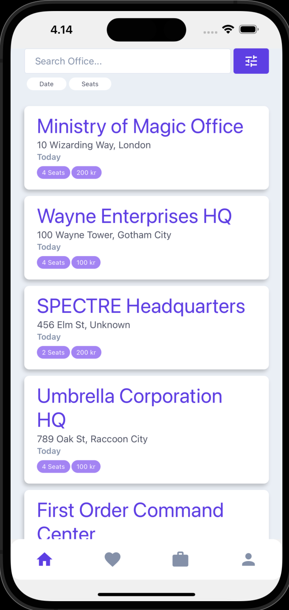
  

  

    <h6>Search (Isaac)</h6>
    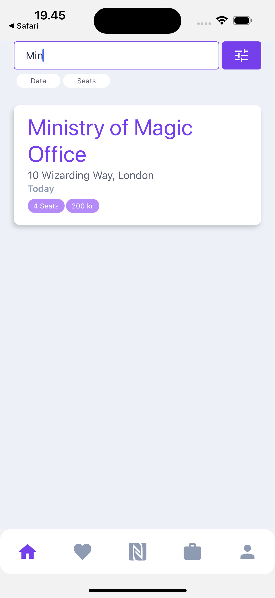
  

  

    <h6>Login (Isaac)</h6>
    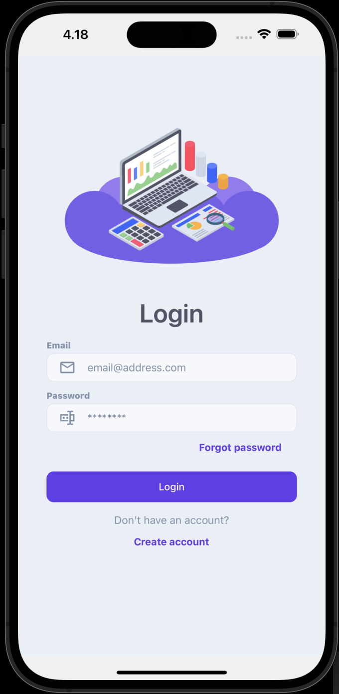
  

  

    <h6>Signup (Isaac)</h6>
    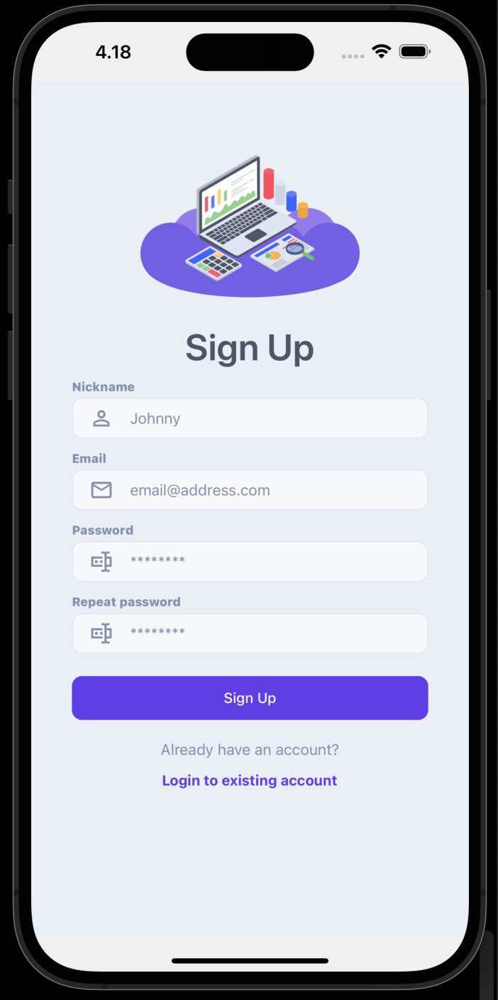
  

  

    <h6>Nfc (Isaac)</h6>
    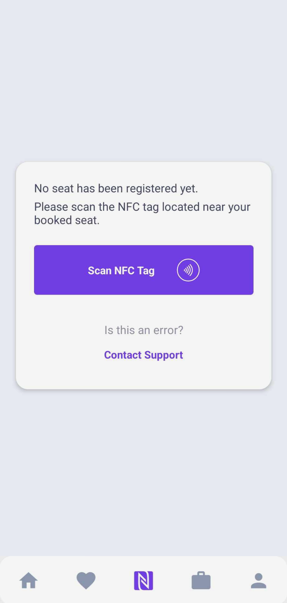
  

  

    <h6>Nfc Scanner (Isaac)</h6>
    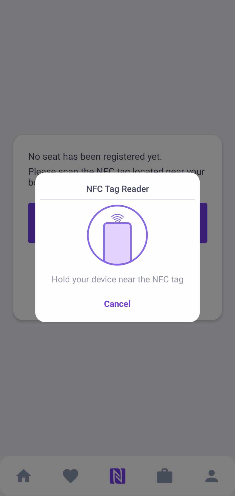
  

  

    <h6>Booking Site (Isaac)</h6>
    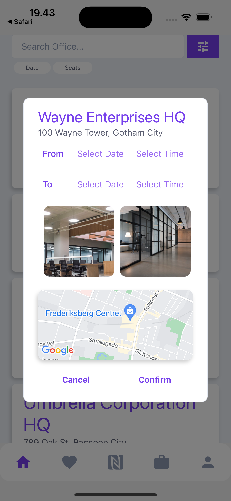
  

  

    <h6>Date Picker (Isaac)</h6>
    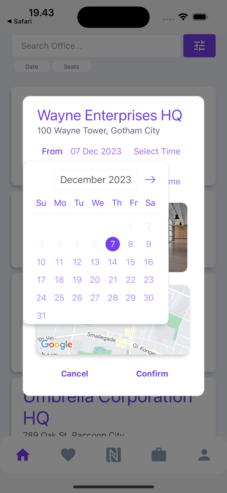
  

  

    <h6>Time Picker (Isaac)</h6>
    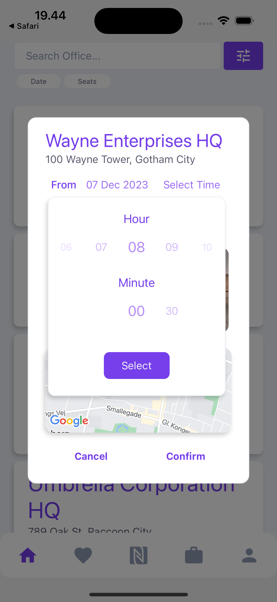
  

  

    <h6>Booking with date selected (Isaac)</h6>
    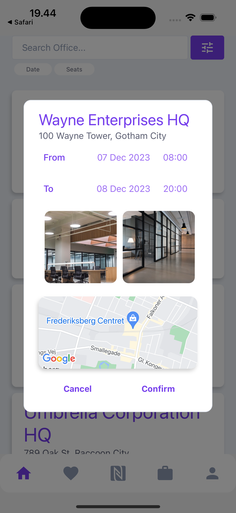
  

  

    <h6>Image Viewer (Isaac)</h6>
    
  

  

    <h6>Order Confirmation (Isaac)</h6>
    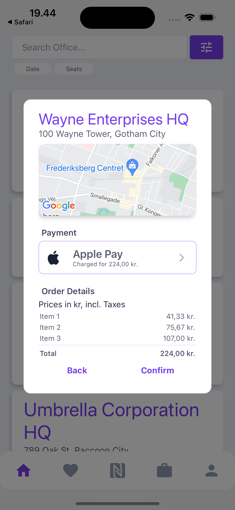
  

### TODO

- [ ] validate input before sending to api
- [ ] error handling på alle input
- [ ] clear input
- [ ] transition mellem screens
- [ ] forgot password
- [ ] App screen
    - [x] Bottom navigation + slide view
    - [x] main search
    - [x] NFC
    - [ ] favorite
    - [ ] history
    - [ ] account
